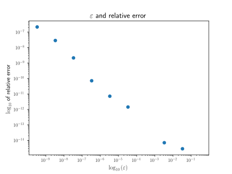

# Homework 2

## Homework usage

The only dependency is NumPy.
The specific code for each question is located inside `src`.

Steps:

1. To start, run `hw2.py`.
2. To select which question should be executed, type in either `1`, `2`, or `3` as directed.
3. To exit the script, type `e` or `E`.

### Question 1

The main code for question 1 is located at `src/hw2_1.py`.
It contains three functions:

- `lu_factor`, which LU factorizes a matrix by Gaussian elimination
- `lu_solve`, which solves $(LU) \mathbf{x} = \mathbf{b}$ given an appropriate LU factorization by forward and backward substitution
- `hw2_1_main`, which performs the operations required by question 1

The input file `inputs/input2_1.txt` should not be altered.

#### Question 1 Results

Question 1 involves two $\mathbf{x}_{\textrm{ex}}$ values.

For $\mathbf{x}_{\textrm{ex}} = \begin{pmatrix} 1 & 1 & 1 \end{pmatrix}^\top$, type in `A` as directed.
The script verifies that for the prescribed $\varepsilon$ values, the computed solution via LU factorization is not affected by rounding errors.

For $\mathbf{x}_{\textrm{ex}} = \begin{pmatrix} \log{(5/2)} & 1 & 1 \end{pmatrix}^\top$, type in `B` as directed.
The script prints the relative error
$$\frac{\lVert \mathbf{x}_{\textrm{ex}} - x \rVert}{\lVert \mathbf{x}_{\textrm{ex}}\rVert}.$$

The following is the relative error outputs.

```text
k = 0: 0.0
k = 1: 2.871833850466502e-15
k = 2: 7.073909407277139e-15
k = 3: 0.0
k = 4: 1.435916925233251e-12
k = 5: 7.179584626166255e-12
k = 6: 7.179584626166255e-11
k = 7: 2.1538753878498763e-09
k = 8: 2.871833793029825e-08
k = 9: 2.153875209796178e-07
```

A graph of $\varepsilon$ and the relative error is displayed below.



Thus, as $\varepsilon$ gets smaller (as $a_{2,1}$ gets closer to $-2$), the relative error increases.
However, there is an unusual error of $0$ for $k=3$.

### Question 2

The main code for question 2 is located at `src/hw2_2.py`.
It contains two functions:

- `lu_pivot_factor`, which LU factorizes a matrix by Gaussian elimination with partial pivoting
- `hw2_2_main`, which performs the operations required by question 2

The input file `inputs/input2_2.txt` should not be altered.

#### Question 2 Results

The $P$ matrix is:

```text
1 0 0 0
0 1 0 0
0 0 1 0
0 0 0 1
```

The $L$ matrix is:

```text
1.          0.          0.          0.
0.4         1.          0.          0.
0.53333333  0.5         1.          0.
0.73333333 -0.38888889  0.45454545  1.
```

The $U$ matrix is:

```text
15.          6.          8.         11.        
 0.          3.6         1.8        -1.4       
 0.          0.          1.83333333  0.83333333
 0.          0.          0.          0.01010101
```

The solution is successfully computed as $\mathbf{x} = \begin{pmatrix} 1 & 1 & 1 & 1 \end{pmatrix}^\top$.

Observe that $P$ is the identity matrix, so no pivoting was actually needed for the LU factorization of the matrix.

### Question 3

The main code for question 3 is located at `src/hw2_3.py`.
It contains two functions:

- `thomas`, which LU factorizes a tridiagonal matrix using the Thomas algorithm and simultaneously solves $A\mathbf{x} = \mathbf{f}$
- `hw2_3_main`, which performs the Thomas algorithm and prints the solution and the LU factorization

The input file `inputs/input2_3.txt` can be modified to fit any tridiagonal matrix.
The diagonals and the right hand side should be written as row vectors with elements separated by commas.
The file structure is as follows:

```text
diagonal
lower diagonal
upper diagonal
right hand side
```

Note that the Thomas algorithm is stable particularly for symmetric positive definite and diagonally dominant matrices.

<!-- ## General usage

### hw2_3.py

The script contains the function `thomas` which performs the Thomas algorithm on a tridiagonal matrix.
If running the script directly, run

```zsh
python hw2_3.py path_to_input
```

where `path_to_input` is a relative or absolute path to the input file.

The input file should be plain text and have the following structure:

The diagonals and the right hand side should be written as row vectors with elements separated by commas.

```text
diagonal
lower diagonal
upper diagonal
right hand side
```

The output is in the same directory labeled `output2_3.txt` and has the following structure:

```text
solution
diagonal of U
lower diagonal of L
``` -->
