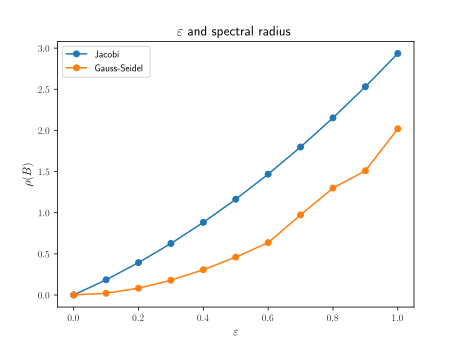

# Homework 4

## Homework usage

Ensure that the files are in the following file tree structure:

```text
.
├── assets/
│   └── graph4_1a.svg
├── inputs/
│   ├── input4_1.txt
│   └── input4_2.txt
├── src/
│   ├── hw4_1.py
│   └── hw4_2.py
├── hw4.py
└── README.MD
```

The dependencies are NumPy, Matplotlib and tqdm.
The specific code for each question is located inside `src`.

Steps:

1. To start, run `hw4.py`.
2. To select which question should be executed, type in either `1` or `2`, then `A` or `B` as directed.
3. To exit the script, type `e` or `E`.

### Question 1

The main code for question 1 is located at `src/hw4_1.py`.
It contains five functions:

- `construct_A`: constructs an $n \times n$ matrix $A$ as in the question with parameter $\varepsilon$
- `iteration_matrix`: constructs the iteration matrix for either the Jacobi or Gauss-Seidel method
  - Jacobi:
    $$B_{\textrm{J}} = I - D^{-1}A$$
  - Gauss-Seidel:
    $$B_{\textrm{GS}} = (D-E)^{-1}(D-E-A)$$
- `spectral_radius`: computes the spectral radius of a matrix
- `richardson`: performs the stationary Richardson method with choice of preconditioner and $\alpha$ with stopping criteria

$$\frac{\lVert \mathbf{r}^{(k + 1)} \rVert_2}{\lVert \mathbf{r}^{(0)} \rVert_2} < \texttt{tol}$$

- `hw4_1_main`: controls the operations for question 1

The input file `inputs/input4_1.txt` should not be altered.

---

#### Question 1 Part A

The graph of $\varepsilon$ values and spectral radii of the iteration matrices.



For convergence of iterative methods like Jacobi and Gauss-Seidel, the spectral radius must be less than $1$.
So the Jacobi method converges for $\varepsilon \leq 0.4$, whereas the Gauss-Seidel method converges for $\varepsilon \leq 0.7$.

#### Question 1 Part B

For $\varepsilon = 0.5$, the Gauss-Seidel method is better.
The solution is

```text
[0.73684211 0.42105263 0.21052632 0.42105263 0.73684211]
```

and it took the Gauss-Seidel method 28 iterations to converge.

### Question 2

The main code for question 2 is located at `src/hw4_2.py`.
It contains three functions:

- `hilbert`: constructs an $n \times n$ Hilbert matrix
- `gradient_method`: performs the gradient method with a preconditioner (use the identity matrix if no preconditioner is desired) and the same stopping criteria as the Richardson method above
- `hw4_2_main`: controls the operations for executing question 2

The input file `inputs/input4_2.txt` should not be altered.

---

Observe that by additive commutativity, the Hilbert matrix is symmetric:
$$A_{ij} = \frac{1}{i + j - 1} = \frac{1}{j + i - 1} = A_{ji}.$$
Next, verify that all the eigenvalues are real and positive.

```text
[1.56705069e+00 2.08534219e-01 1.14074916e-02 3.05898040e-04 3.28792877e-06]
```

Since the Hilbert matrix is symmetric and positive definite, the gradient method can be used to solve the system.

#### Question 2 Part A

The preconditioned gradient method took $425887$ iterations to converge and the computed solution is

```text
[0.9999996  1.00000745 0.99996787 1.0000485  0.99997629]
```

#### Question 2 Part B

The gradient method with no preconditioner does not converge in less than $500000$ iterations.
If the eigenvalues of $A$ are ordered $\lambda_1 > \lambda_2 > \cdots > \lambda_5 > 0$, then the condition number of $A$ is
$$K_2(A) = \frac{\lambda_1}{\lambda_5} \approx \frac{1.567}{3.288 \times 10^{-06}} \approx 476607$$
which is quite large.
Since $K_2(A)$ is large, the change in error each iteration is very small, and so the non-preconditioned gradient method for solving this system converges very slowly.
