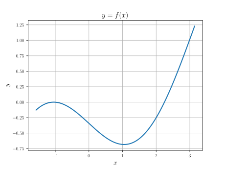
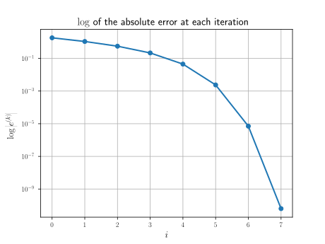

# Homework 7

## Homework usage

Ensure that the files are in the following file tree structure:

```text
.
├── assets/
│   ├── graph_7_1.svg
│   └── graph_7_2.svg
├── inputs/
│   ├── input7_1.txt
│   └── input7_2.txt
├── src/
│   ├── hw7_1.py
│   └── hw7_2.py
├── hw7.py
└── README.MD
```

The dependencies are NumPy and Matplotlib.
The specific code for each question is located inside `src`.

Steps:

1. To start, run `hw7.py`.
2. To select which question should be executed, type in `1` or `2`.
3. To exit the script, type `e` or `E`.

### Question 1

Within the prompt for question 1, type in `A` or `C` to select the part.

The main code for question 1 is located at `src/hw7_1.py`.
It contains three functions:

- `graph`: graphs a single variable function over an interval $[a,b]$ with `n_val` divisions
- `bisection`: performs the bisection method with tolerance `tol`
- `hw7_1_main`: controls the operations for question 1

The input file `inputs/input7_1.txt` should not be altered.

---

#### Part A

The graph of $f(x) = \frac{x}{2} - \sin{(x)} + \frac{\pi}{6} - \frac{\sqrt{3}}{2}$ on the interval $\left[-\frac{\pi}{2}, \pi \right]$ is displayed below.



Notice that $f$ has a root that only touches zero but does not cross the $x$-axis, so there is no sign change, and hence the bisection method would not detect a zero there.

Alternatively, note that $f'(x) = \frac{1}{2} - \cos{(x)}$, and that both $f'\left(-\frac{\pi}{3}\right) = 0$ and $f \left(-\frac{\pi}{3} \right) = 0$, so $f$ has a zero at a local extrema and hence the bisection would not work.

#### Part C

The bisection method was performed on $f$ over the interval $\left[-\frac{\pi}{2}, \pi\right]$.
The root is approximately $\alpha \approx 2.246$ and the method took $33$ iterations to get to a residual of $5.296 \times 10^{-11}$.

### Question 2

Within the prompt for question 2, type in `B` or `C` to execute the respective part.

The main code for question 2 is located at `src/hw7_2.py`.
It contains two functions:

- `fix_point`: performs the fixed point iteration for a function
- `hw7_2_main`: controls the operations for executing question 2

The input file `inputs/input7_2.txt` should not be altered.

---

#### Part B

The fixed point iteration of
$$x^{(k+1)} = x^{(k)} - \frac{\left(x^{(k)}\right)^4 - 2}{4\left(x^{(k)}\right)^3}$$
with initial guess $x^{(0)} = 4$ converged in $8$ iterations.
The fixed point is approximately $\alpha \approx 1.189$ with error $6.319 \times 10^{-11}$.

#### Part C

Some values of the absolute error $e^{(k)} = \left\lvert x^{(k)} - 2^{1/4} \right\rvert$

| iteration $k$ | error $e^{(k)}$         |
|---------------|-------------------------|
| $1$           | $1.819$                 |
| $2$           | $1.085$                 |
| $3$           | $5.590 \times 10^{-1}$  |
| $3$           | $2.155 \times 10^{-1}$  |
| $5$           | $4.472 \times 10^{-2}$  |
| $6$           | $2.373 \times 10^{-3}$  |
| $7$           | $7.078 \times 10^{-6}$  |
| $8$           | $6.319 \times 10^{-11}$ |

The logarithmic graph of the error is displayed below.

